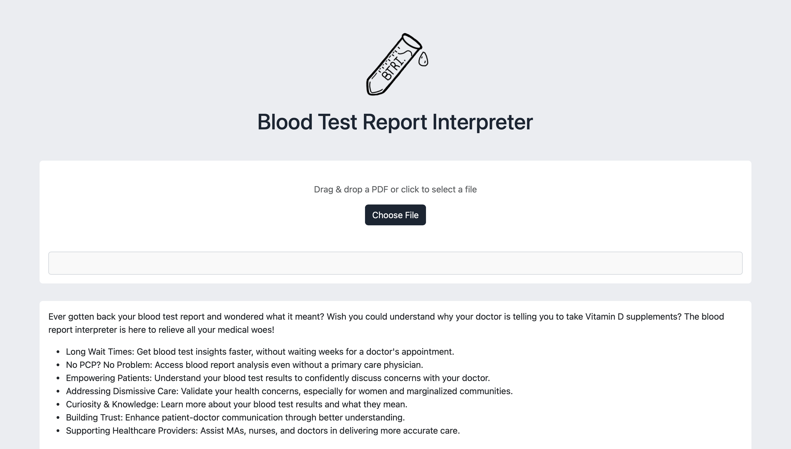

# Blood Test Report Interpreter

[**TL;DR**] Analyzes and summarizes blood test reports while providing actionable lifestyle changes to improve your health

## About the Project
This project analyzes and summarizes your blood test results. It gives you information what each biomarker indicates and whether you are in a good range is and what would be good steps to take to improve your health.

We also hoped to increase patients' confidence in approaching their healthcare professionals with their concerns. Often patient’s concerns are dismissed, especially women’s concerns or people from marginalized communities, whether that is due to prejudice, lack of research, or even just human error. The goal of this project isn’t to diagnose, reduce trust in healthcare professionals, or even to give medical advice, but help patients have a little more agency over their physical health which would go a long way in helping them be more comfortable in bringing their medical concerns to their providers.

*Disclaimer: *This project is for informational purposes only and **does not provide medical advice**. It should not be used as a substitute for consulting with a qualified medical professional. It should also not be used for clinical purposes, as a substitute for professional medical advice, or in any manner that is overseen by or requires clearance or approval from any applicable regulatory authority.  Always consult with your doctor or other healthcare provider for any questions you may have regarding your health or a medical condition.*

## Built with:
- HTML/CSS/JS
- Flask
- Celery + Redis
- Gemini
- Deployed on Render
- Domain [bloodreportinterpreter.co](bloodreportinterpreter.co) from GoDaddy

## Getting Started (for devs)
To run this project locally, follow these steps:
1. **Prerequisites:** Ensure you have Python installed on your device.  It's recommended to use the latest stable version.

2. **Clone the repository:**
```git clone [https://github.com/AyeshaIlyas/blood-test-report-interpreter.git](https://github.com/AyeshaIlyas/blood-test-report-interpreter.git)```

3. **Navigate into the project directory:**
```cd blood-test-report-interpreter```

4. **Create and activate a virtual environment (recommended):**
   - ```python3 -m venv <your-env-name>``` - Create the virtual environment
   - ```source <your-env-name>/bin/activate```  - Activate the virtual environment (Linux/macOS)
   - ```<your-env-name>\Scripts\activate```  - Activate the virtual environment (Windows)
 
5. **Set up environment variables:** 
```
GEMINI_KEY=<your-key>
CELERY_BROKER_URL=<broker-url>
```
- If using redis <broker-url> is redis://localhost:6379/0

6. **Install dependencies:**
- NOTE: You need to download redis. If you have `brew` you can use `brew install redis`

- ```pip3 install -r requirements.txt```

7. Start the redis server: `redis-server`

8. Start the celery worker **__from the parent directory__**: `celery -A celery_app worker --loglevel=info --pool=solo`

9. **Run the flask app:**
```flask run```

10. **Access the application:** Navigate to `http://127.0.0.1:5000/` in your web browser.



12. **Load and interpret reports:** You can now load your blood test reports and use the application to explore and interpret your results.

## Stopping Everything
- Shut down flask server with `Ctrl + C`
- Run the following two commands:
```bash
redis-cli shutdown
pkill -9 -f celery
```
